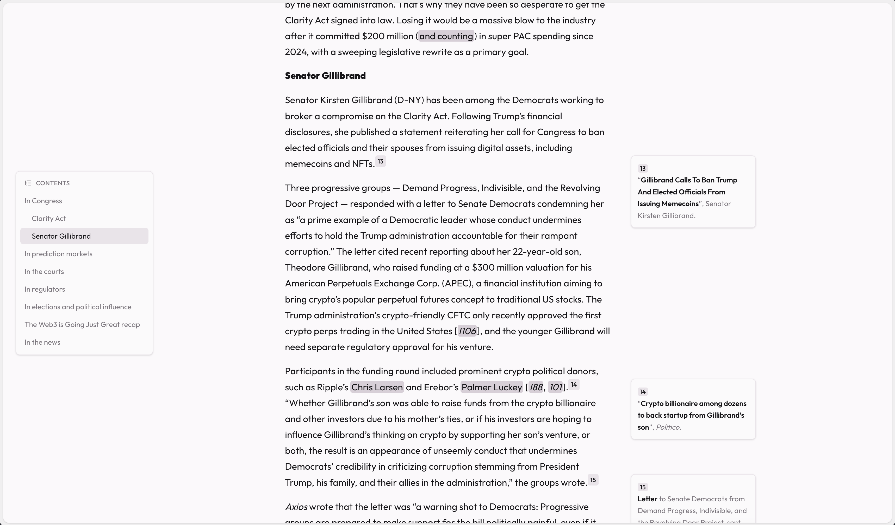
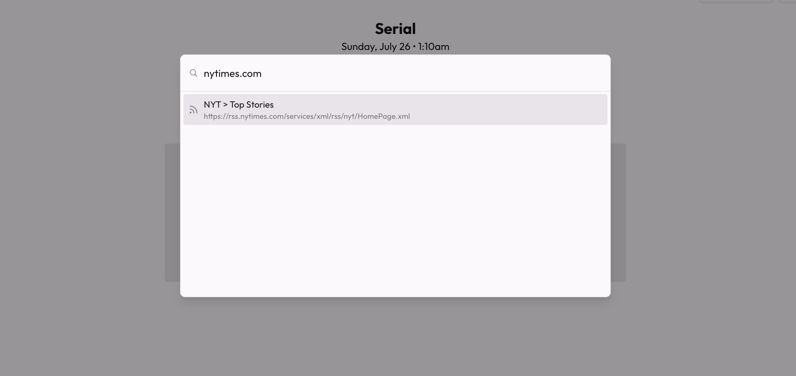
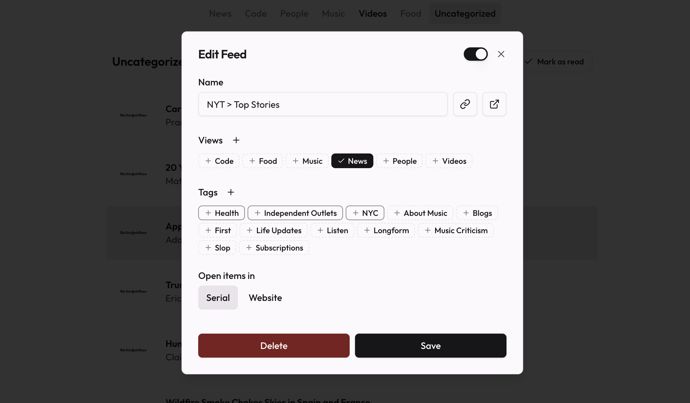

## Article Footnotes and Contents

Long articles have traditionally been a little clunky to interact with in Serial. Now, articles with references or footnotes will show them inline next to the content, making them much easier to view. 

Tables of Contents are also available for articles, hidden by default – hover your mouse at the left side of the screen to jump between article headings.

Both features can be enabled/disabled in the article appearance settings. 

## Improved Feed Adding and Management

The experience of adding feeds has been streamlined - feeds are searched for and found in a new command palette:

The biggest changes come in the edit feed dialog – assigning views and tags are now as simple as toggling the ones you want (as opposed to wrestling with a popover UI).

When you select a view, tags that appear as view subsections will be highlighted at the front of the tags list. This makes it much easier to know which tags will actually affect the feed’s placement in the view section. 

For more information on view sections, check out the [recent release notes!](/releases/2026-06-14)

## Improvements

- Added the ability to copy the active article or video’s URL, through a button or through <kbd>Shift + c</kbd>
- Added the ability to drag `.opml` or `subscriptions.csv` files directly into the app to import
- Improved article parsing for certain feeds, making keyboard-based navigation more consistent

## Fixes

- Fixed an issue where deleting a view would leave any associated view sections broken in the view editing modal until refresh
- Removed a small amount of extra padding on the right side of the main content area
- Fixed some UI discrepencies between embedded videos in articles and the primary custom video UI
- Fixed an issue where YouTube captions would be unconfigurable, even in instances where captions were showing on the video
- Fixed an issue where the fallback YouTube player option would show a black screen

## Changes

- New views default to <var>Large List</var>, instead of the standard <var>List</var>
- The inline shortcuts display now defaults to off
- Marking an item as read/unread in “Saved” no longer advances to the next item automatically
- Tweaked article text and element spacing

## For self-hosters

- Fixed an issue with non-Coolify self-hosted Docker deployments where environment variables wouldn't apply correctly ([#240](https://github.com/megaflorasoftware/serial/issues/240))
- Updated public variables to default to `PUBLIC_*` instead of `VITE_PUBLIC_*` to better reflect how those variables are applied to the frontend
  - `VITE_PUBLIC_*`-prefixed variables will continue to remain backwards-compatible for the foreseeable future, but are no longer the recommended pattern

## For contributors

- Added a `dev:demo` command to quickly spin up test environments locally
- Added robust random port spin up scripts to allow for running tests and dev servers in multiple concurrent sessions without conflicting with each other
