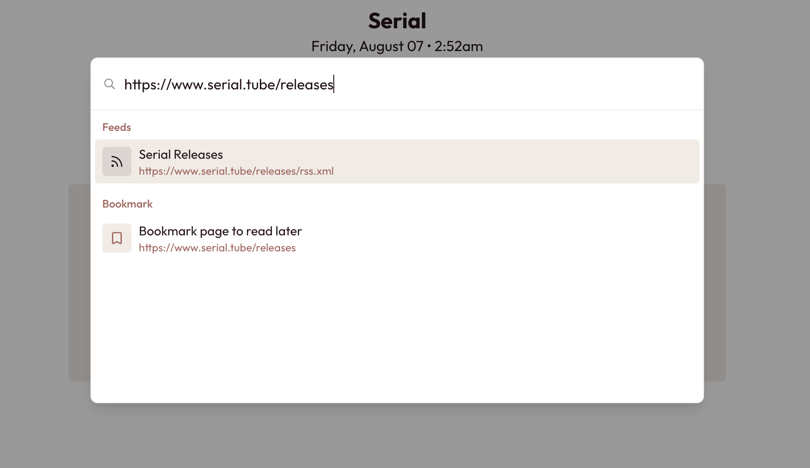
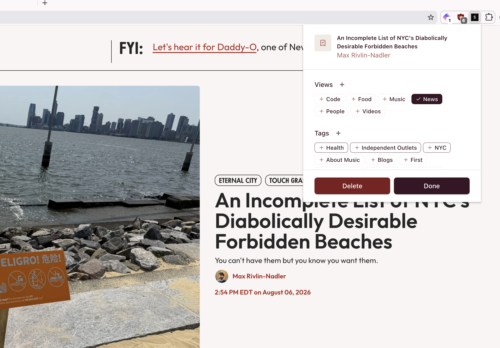
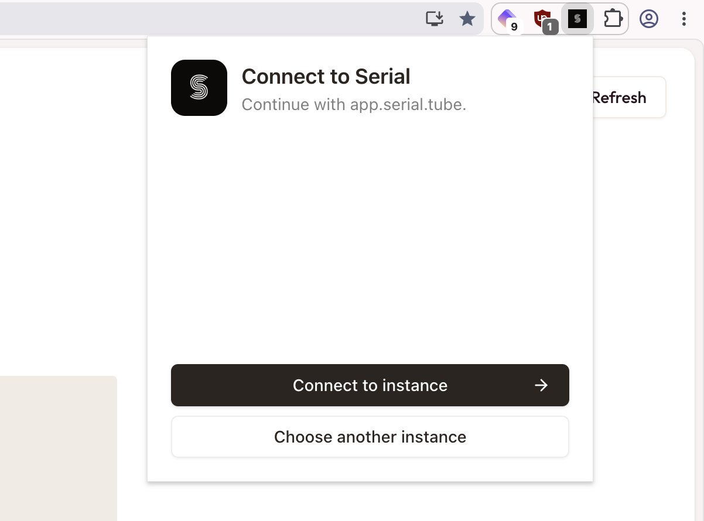

## Bookmarks

Serial now supports saving any webpage as a bookmark. This is available in app today in the add modal, right under the potential feed subscriptions:

> Quick tip – you can open this modal at any time by pressing the <kbd>a</kbd> key!

Saving items in app is great, but where this really shines is with the new Serial browser extension (available for [Chrome](https://chromewebstore.google.com/detail/serial/olpaonddchkbjpmjjfamplfaibopllam) and [Firefox](https://addons.mozilla.org/en-US/firefox/addon/serial-reader/)). Now, you can save content to Serial from anywhere on the web!

Clicking the Serial browser extension will save whatever your active page is, whether it’s an article, video, blog, podcast, or anything else:

You can organize your bookmarks the same way you already organize your feeds, making it easy to find what you’re looking for later. If that’s a bit too much work to do while you’re browsing, don’t worry about it – your bookmarks will drop into the “Uncategorized” view by default, letting you clean them up at a later date.

One final note: the extension is available for everyone, regardless of if you use the main instance or a self-hosted instance. When logging in, the extension will let you choose your home instance, and will automatically detect it when logging in with that instance open:

The extension is currently available for [Chrome](https://chromewebstore.google.com/detail/serial/olpaonddchkbjpmjjfamplfaibopllam) and [Firefox](https://addons.mozilla.org/en-US/firefox/addon/serial-reader/), with Safari support planned for the future (Apple likes to make things a little bit more involved than everyone else, so it’ll get tackled a little later). Give it a shot, and don’t feel shy to [raise an issue](https://github.com/megaflorasoftware/serial/issues/new?template=bug-report.md) if anything is a little rough around the edges.

Happy bookmarking!

